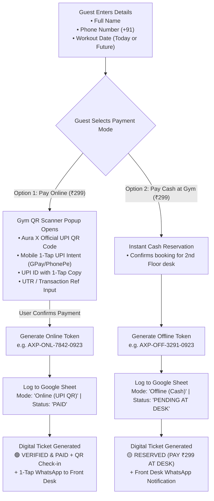

# Day Pass Experience: Aura X Fitness Gym UPI Scanner & Cash Flow Plan

## Overview
This updated implementation plan incorporates your new requirements:
1. **Remove Timing Slots**: The form asks only for **Full Name**, **Phone Number**, and **Workout Date**.
2. **Aura X Fitness Gym UPI Scanner Popup**: For Online Payment (₹299), an elegant popup modal displays the gym's official QR code scanner with quick-pay options.
3. **Offline / Cash Payment Flow**: For guests paying cash at the front desk, records their details and reserves the pass without requiring immediate online payment.
4. **Token Generation**: Generates a distinctive token (`AXP-ONL-XXXX` or `AXP-OFF-XXXX`) based on payment mode.
5. **New Google Sheet Logging**: Automatically posts records to a dedicated Day Pass Google Sheet with full breakdown (Timestamp, Token, Name, Phone, Date, Payment Mode: Online/Offline, Status, Amount).

> [!NOTE]
> As requested: **Only this implementation plan is updated. No code has been modified.** Code changes will only start once you review and approve this plan.

---

## 1. User Journey & Flow Architecture

---

## 2. Dedicated Google Sheet Schema

Every submission automatically creates a row in your new Google Sheet:

| Column | Header | Example Value | Description |
|---|---|---|---|
| **A** | `Timestamp` | `23/09/2026 14:15:30` | Date & time of request |
| **B** | `Pass Token` | `AXP-ONL-4821-0923` | Unique token (`AXP-ONL-...` or `AXP-OFF-...`) |
| **C** | `Guest Name` | `Rahul Sharma` | Lifter's full name |
| **D** | `Phone Number` | `9876543210` | 10-digit mobile number |
| **E** | `Workout Date` | `2026-09-23` | Selected workout date |
| **F** | `Payment Mode` | `Online (UPI QR)` or `Offline (Cash at Desk)` | Payment pathway chosen |
| **G** | `Payment Status` | `PAID (Online UPI)` or `PENDING (Cash at Reception)` | Reception status |
| **H** | `Transaction / UTR` | `429185739182` or `Cash at Counter` | UTR reference if paid online |
| **I** | `Amount` | `₹299` | Fixed 1-day pass amount |

> [!TIP]
> We will provide a 1-click **Google Apps Script** snippet ready to paste into `Extensions > Apps Script` on your new Google Sheet, with auto-formatting that colors Online rows in soft green and Offline rows in warm amber.

---

## 3. High-Value Suggestions to Improve This System

Here are 6 practical improvements tailored specifically for gym operations:

### 💡 Suggestion 1: Mobile "1-Tap UPI Intent" Buttons (Crucial for Conversions)
- **Problem**: On mobile phones, users cannot scan a QR code displayed on their own phone screen unless they have a second device.
- **Solution**: Inside the popup, along with the QR code image, include direct 1-tap buttons:
  - `[ Pay with GPay ]`
  - `[ Pay with PhonePe ]`
  - `[ Pay with Paytm / Any UPI ]`
  This uses standard UPI intent (`upi://pay?pa=<gym-upi-id>&pn=Aura+X+Fitness&am=299&cu=INR`) which directly opens their payment app with ₹299 prefilled.

### 💡 Suggestion 2: UTR / Reference ID Field (Prevents Payment Fraud)
- In the QR popup, provide an optional or required **"Enter UPI Ref / UTR No. (Last 4 or 12 digits)"**.
- When the guest clicks "I Have Paid", this UTR is saved to the Google Sheet. Front desk staff can match it in 5 seconds against the gym's bank SMS/soundbox without arguing over screenshots.

### 💡 Suggestion 3: WhatsApp Instant Verification Link
- Once the pass is generated, show a primary action button: **"Send Pass to Gym WhatsApp"**.
- 1-tap opens WhatsApp directly to Aura X reception (`+91 78998 88543`) with the pre-formatted text:
  > *"Hi Aura X Team, I booked a 1-Day Pass! Name: [Name], Token: [Token], Date: [Date], Mode: [Online UPI / Cash at Desk]. See you at the gym!"*

### 💡 Suggestion 4: Download / Screenshot-Friendly Pass Card
- Style the generated pass as an Apple Wallet / boarding pass style ticket with:
  - Gold holographic border & Aura X branding
  - Large display of the unique Token (`AXP-ONL-...` or `AXP-OFF-...`)
  - Entry QR code encoding token + Gym address for rapid check-in
  - "Download Pass" or "Save to Phone" quick action

### 💡 Suggestion 5: Offline Reservation Auto-Hold Policy
- Clearly display on cash passes: *"Reserved for [Date]. Please arrive and pay ₹299 at 2nd Floor desk to activate entry."*
- Unpaid offline tokens expire at 11:59 PM on the selected workout date to prevent stale records.

### 💡 Suggestion 6: Front Desk Quick-Search in Google Sheet
- Provide a summary header row in the Google Sheet showing:
  - Total Passes Today | Total Online Revenue (₹) | Total Cash to Collect (₹)
  - Front desk can type a token in a search cell or filter by "PENDING" to see who owes cash today.

---

## 4. Component & UI Design Details

### A. The Input Form (Clean 3-Field Layout)
- **Full Name**: Single clean text field with icon.
- **Phone Number**: 10-digit number field with fixed `+91` flag prefix and automatic validation.
- **Workout Date**: Native date picker starting from today (`min={today}`).
- *(Timing slot dropdown is completely removed).*

### B. Payment Choice Selector
Two interactive selector cards:
1. **⚡ Pay Online via UPI QR (₹299)**
   - Subtitle: *Instant check-in • Scan QR or Tap UPI*
   - Clicking opens the **Aura X Scanner Modal**.
2. **🏢 Pay Cash on Arrival (₹299)**
   - Subtitle: *Pay at 2nd Floor desk when you arrive*
   - Clicking immediately generates the cash reservation token.

### C. The Aura X Scanner Popup Modal
- **Header**: "Scan to Pay ₹299 • Aura X Fitness"
- **QR Display**: Crisp, high-resolution Aura X Gym UPI QR code.
- **UPI Details**: `auraxfitness@upi` (customizable) with a **"Copy UPI ID"** button.
- **Mobile UPI Buttons**: One-tap buttons for GPay, PhonePe, Paytm (auto-opens on phone).
- **UTR Input**: "Enter 12-digit UPI Reference / UTR Number".
- **Action**: "I Have Completed Payment" -> generates `AXP-ONL-...` token and logs to Google Sheet.

---

## 5. Files to Modify (When Approved)

### [MODIFY] [src/main.jsx](file:///c:/Users/R.Giridharan/Desktop/AURAX/src/main.jsx)
- Remove timing slot states and selector elements.
- Implement dual payment selector (Online UPI vs Offline Cash).
- Create the **UPI QR Scanner Modal** component with mobile intent links and UTR capture.
- Update token generator:
  - `AXP-ONL-[random4]-[date]` for Online UPI
  - `AXP-OFF-[random4]-[date]` for Offline Cash
- Update Google Sheets webhook call to send new payload format.
- Update Digital Pass preview card with dynamic status (Paid Green vs Pay at Desk Amber).

### [MODIFY] [src/styles.css](file:///c:/Users/R.Giridharan/Desktop/AURAX/src/styles.css)
- Add modal styles: backdrop blur, gold-accented modal dialog, responsive QR code framing.
- Style mobile 1-tap UPI app buttons (GPay / PhonePe / Paytm colors and badges).
- Add payment method selector cards with hover, active, and selected glow effects.
- Ensure 100% responsiveness on mobile screens (360px – 480px).

---

## 6. Verification Plan

### Manual Verification Flow
1. **Form Verification**:
   - Ensure only Full Name, Phone, and Workout Date are present.
   - Verify invalid phone numbers (< 10 digits) or past dates cannot be submitted.
2. **Online UPI QR Flow**:
   - Click "Pay Online via UPI QR".
   - Confirm popup modal appears with Aura X QR Scanner, amount ₹299, and UPI ID.
   - On mobile, verify UPI intent links trigger installed UPI apps.
   - Enter UTR / Click "Confirm Payment".
   - Confirm token `AXP-ONL-XXXX` is displayed with green "VERIFIED & PAID" status.
   - Check Google Sheet receives row with `Payment Mode: Online (UPI QR)` and status `PAID`.
3. **Offline Cash Flow**:
   - Select "Pay Cash on Arrival".
   - Click "Reserve Pass".
   - Confirm token `AXP-OFF-XXXX` is displayed with amber "RESERVED (PAY AT DESK)" status.
   - Check Google Sheet receives row with `Payment Mode: Offline (Cash)` and status `PENDING`.
4. **WhatsApp Integration**:
   - Click "Share on WhatsApp" for both flows and ensure message template reflects the correct mode and token.
